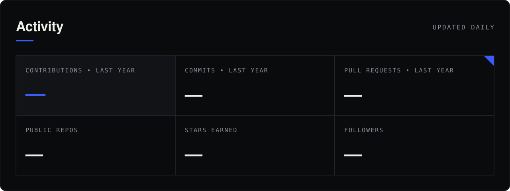

  

  <a href="https://nylontech.net"><code>nylontech.net</code></a>&nbsp;&nbsp;•&nbsp;&nbsp;
  <a href="https://nylonhosting.org"><code>nylonhosting.org</code></a>&nbsp;&nbsp;•&nbsp;&nbsp;
  <a href="https://github.com/NylonTechnologies"><code>@NylonTechnologies</code></a>

 

  

  

  <a href="https://github.com/Koomball/BDFD-Variables-With-Json"><code>Read the BDFD Variables with Json guide →</code></a>

 

  

 

  

